# nplayer v0.2.0

Iceberg-ready Parquet output, 2.6× faster conversion, and a `--jobs` default
that sizes itself to the machine.

| | |
|---|---|
| Release date | 2026-09-07 |
| Previous | v0.1.0 |
| Requires | Apache Arrow / Parquet 25, zstd, fmt (the `dev` image) |

Conversion of one day of CME MBO data (47.5M records, 775 MB compressed)
drops from 8.4 s to 3.2 s on 8 cores. The full five-day sample converts in
11.5 s with default arguments, down from 46.8 s.

---

## Output schema: Iceberg primitive types

**Breaking.** Every column now uses a type from the Iceberg primitive set,
so the files register in an Iceberg catalog without a cast. pyiceberg's
schema conversion rejected the v0.1.0 files on the first timestamp column;
it accepts the v0.2.0 files as written.

| Column | v0.1.0 | v0.2.0 | Iceberg |
|---|---|---|---|
| `ts_recv`, `ts_event`, `ts_out` | `timestamp[ns, UTC]` | `int64`, Unix-epoch nanoseconds | `long` |
| `rtype`, `channel_id`, `flags`, `depth` | `uint8` | `int32` | `int` |
| `publisher_id` | `uint16` | `int32` | `int` |
| `instrument_id`, `size`, `sequence` | `uint32` | `int64` | `long` |
| `order_id` | `uint64` | `int64` | `long` |
| `price` | `int64` | `int64` | `long` |
| `ts_in_delta` | `int32` | `int32` | `int` |
| `action`, `side` | `string` | `string` | `string` |

Timestamps stay at nanosecond precision. Iceberg's `timestamp` type holds
microseconds, so the value is stored as a plain integer and the file
metadata gains `timestamp_unit = ns`. The undefined sentinels still become
nulls. An `order_id` at or above 2^63 comes out negative; a cast back to
unsigned restores it, and CME ids stay far below that bound.

Column order, encodings, compression, and the `dbn.*` metadata keys are
unchanged. Row values are identical to v0.1.0 after a type cast; the release
was checked column by column against the previous output over 47.5M rows.

---

## Performance: 2.6× on one file, 4× on the sample set

| Workload | v0.1.0 | v0.2.0 |
|---|---|---|
| One file, 47.5M records | 8.4 s | 3.2 s |
| Five files, `--jobs 1` | 46.8 s | 21.0 s |
| Five files, `--jobs 5` | 15.8 s | 9.1 s |
| Five files, default arguments | 46.8 s | 11.5 s |

Measured in the `dev` container with 8 vCPUs and 7.7 GB on an Apple M4 Pro.


### Where the time went

A stage-by-stage benchmark of the decoder thread showed zstd decompression
at 2.1 s and record iteration at 2.2 s, but Arrow column building at 7.3 s.
Five of the eight seconds per file were spent appending values one at a
time through `arrow::NumericBuilder::UnsafeAppend`, about 107 ns per record
across 14 columns. perf attributed 46% of the decoder thread to that one
function, which GCC keeps out of line, and a further 22% to the append loop
around it.

The writer thread took 7.2 s of CPU for the same file. Compression was 15%
of that; Parquet page encoding on a single thread was the rest.



### What changed

**Columns write straight into reserved buffers.** Each batch calls
`Reserve`, takes the buffer pointer with `GetMutableValue`, stores values by
index, and closes the batch with `UnsafeAdvance`. Arrow documents this
sequence for exactly this use. Nullable columns keep a validity bitmap that
starts all valid and clears a bit only on a sentinel, so the common case is
one store. The one-character `action` and `side` columns share a single
offsets buffer built once, sliced per batch. Column building fell from 7.3 s
to 2.8 s; the decoder thread is now within 0.6 s of the zstd floor.

**Batches encode in parallel.** The writer enables
`ArrowWriterProperties::set_use_threads`, which spreads the columns of a
batch over Arrow's CPU thread pool. Writer-thread time per file fell from
7.2 s to under 1 s of wall clock. Output bytes are unchanged.


---

## `--jobs` picks itself

`--jobs` now defaults to `0`, which chooses a count at start-up. An explicit
`--jobs N` behaves as before. The automatic value is the smallest of:

- the number of input files;
- half the CPU cores;
- 60% of the available memory divided by the estimated peak of one
  conversion, which is `batch_rows × 80 B × 6 + 64 MB` (about 550 MB at the
  default `--batch-rows`).

Available memory is `MemAvailable` from `/proc/meminfo`, capped by the
cgroup limit minus current usage when one is set (cgroup v2 and v1). When
neither is readable the default is one job. The chosen value is printed as
`N files, M at a time`.

| Container memory | Chosen jobs (8 cores, 5 files) |
|---|---|
| unlimited (6.7 GB available) | 4 |
| `--memory 4g` | 4 |
| `--memory 2500m` | 2 |
| `--memory 1200m` | 1 |

The core count comes from `hardware_concurrency`, which ignores a `--cpus`
quota; pass `--jobs` explicitly under a CPU quota.

---

## Upgrading

**Reconvert existing output.** Files written by v0.1.0 carry the old types.
Readers that mix versions must handle both.

**Cast timestamps on read.** The integer is Unix-epoch nanoseconds:

```sql
-- DuckDB
select make_timestamp_ns(ts_event) as ts_event from 'day.parquet';
```

```python
# pyarrow
table.column("ts_event").cast(pa.timestamp("ns", tz="UTC"))
```

**Unsigned readers.** Code that read `rtype`, `flags`, `size`, or
`sequence` as unsigned still works; the values fit. `order_id` needs a cast
to unsigned only for ids at or above 2^63.

**Scripts that relied on `--jobs 1`.** Pass `--jobs 1` explicitly to keep
serial conversion, for instance on a shared host.

---

## Known issues

- **Symlinked input files escape the output tree.** `convert_tree` resolves
  symlinks when it computes the output path, so a symlink under `--input`
  writes its Parquet file beside the link target. Use real files or bind
  mounts.

---

## How it was measured

- **Baseline:** per-thread CPU time and peak RSS sampled from `/proc` while
  converting one file.
- **Stage benchmark:** the same file through zstd only, decode only,
  decode plus column building, and the full writer, each timed alone.
- **perf:** flat and call-graph profiles of the real binary and of a
  frame-pointer build, taken in a privileged container with
  `linux-tools-6.8.0-117-generic`.
- **Encoder experiment:** 12M rows written under each compression codec,
  with and without dictionaries and statistics, and with and without
  `use_threads`. zstd level 1 is Arrow's default; lz4 and snappy were 10%
  faster and 30% larger; `use_threads` alone was 4× faster with identical
  bytes.
- **Correctness:** pyarrow column-by-column comparison against the v0.1.0
  output at nanosecond precision, and pyiceberg schema conversion of every
  output file.
